<div align="center">

<h1>ScaleResfusion: Residual Rectified Flow based on Residual Vector Field</h1>

<div>
    <a href="https://yukinoshitalove.github.io/" target="_blank">Zhenning Shi</a><sup>1,*</sup>&emsp;
    Chen Xu<sup>2,*</sup>&emsp;
    Junhao Zhang<sup>3</sup>&emsp;
    Kefei Zhang<sup>1</sup>&emsp;
    Linjie Liu<sup>4</sup>&emsp;
    <a href="https://www.zdzheng.xyz/" target="_blank">Zhedong Zheng</a><sup>2,&dagger;</sup>&emsp;
    Tao Li<sup>1,&dagger;</sup>
</div>
<div>
    <sup>1</sup>Nankai University&emsp;
    <sup>2</sup>University of Macau&emsp;
    <sup>3</sup>CSIRO Data61&emsp;
    <sup>4</sup>Beihang University
</div>
<div>
    <sup>*</sup>Equal contribution&emsp;<sup>&dagger;</sup>Corresponding authors
</div>

<br>

[](https://arxiv.org/abs/2607.25275)
[](https://yukinoshitalove.github.io/ScaleResfusion/)
[](https://mailnankaieducn-my.sharepoint.com/:v:/g/personal/shizhenning_mail_nankai_edu_cn/IQBoy3T-p6qTSLhhpoZn3KyFAaJA3kvdiBXgoGy2aa1AcQ8?e=GmWi7q)
[](#-model-zoo)
[](LICENSE)

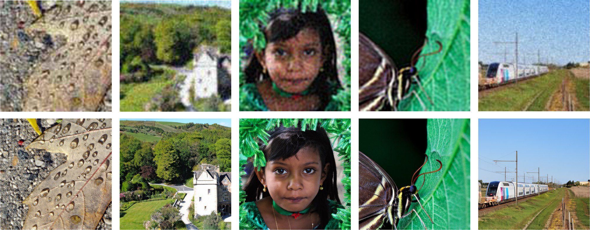
<p><i>Top: real-world low-quality inputs. Bottom: ScaleResfusion (FLUX.2-klein-4B backbone, 4 sampling steps).</i></p>

</div>

---

ScaleResfusion rewrites residual image restoration as a **scheduler-independent adaptation interface** for pre-trained text-to-image rectified-flow models. Its core, **Residual Rectified Flow (RRF)**, inserts the residual term $R=\hat{x}_0-x_0$ into the linear transport path of Rectified Flow, so that sampling starts from the *noisy LQ image* at an exact acceleration point $t^\star = 1/(1+\gamma)$. The optimisation target, the **residual vector field** $resv = v^{RF} + \gamma R$, contains no scheduler-specific coefficients and differs from the pre-trained objective only by the residual offset, so a frozen billion-scale backbone is adapted with **LoRA-only training** (~60M trainable parameters) and restores real-world images in **4 sampling steps**.

## 🔥 News

- **[2026.09]** Inference code for the **FLUX.2-klein-4B** backbone is released. Pretrained LoRA weights and benchmark results are coming soon.
- **[2026.07]** The [paper](https://arxiv.org/abs/2607.25275) is on arXiv.

## 📋 Release Plan

- [x] Inference code — FLUX.2-klein-4B
- [ ] Pretrained LoRA weights — FLUX.2-klein-4B (w/o GAN, w/ GAN) + benchmark results and DAPE captions
- [ ] Inference code and weights — SD3 (2B), Z-Image (6B), FLUX.2-klein-9B
- [ ] Training code

## 🎬 Overview

<p align="center">
  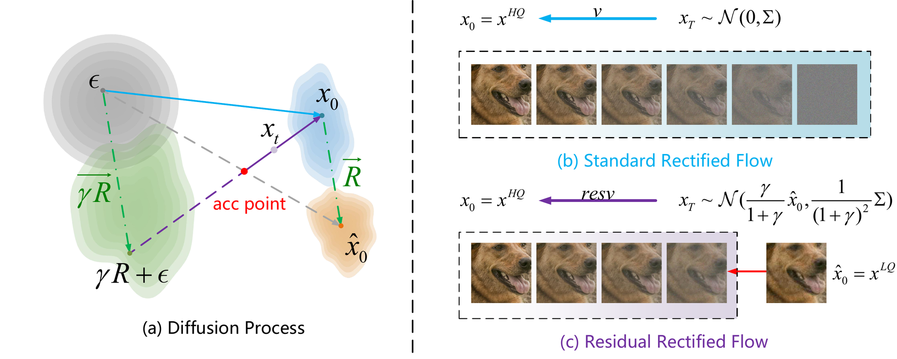
</p>

**Residual Rectified Flow.** (a) RRF (purple) introduces the weighted residual $\gamma R$ into the diffusion path, yielding a straight trajectory that intersects the implicit noise-to-LQ path at the acceleration point. (b) Standard Rectified Flow transports Gaussian noise to the HQ distribution. (c) Starting from the noisy-LQ state $x_{t^\star}\sim\mathcal{N}\big(\tfrac{\gamma}{1+\gamma}\hat{x}_0,\ \tfrac{1}{(1+\gamma)^2}\Sigma\big)$, RRF learns the residual vector field $resv$ to recover the HQ image over a shortened sampling interval. The residual ratio $\gamma$ continuously controls the SNR of the starting point.

<p align="center">
  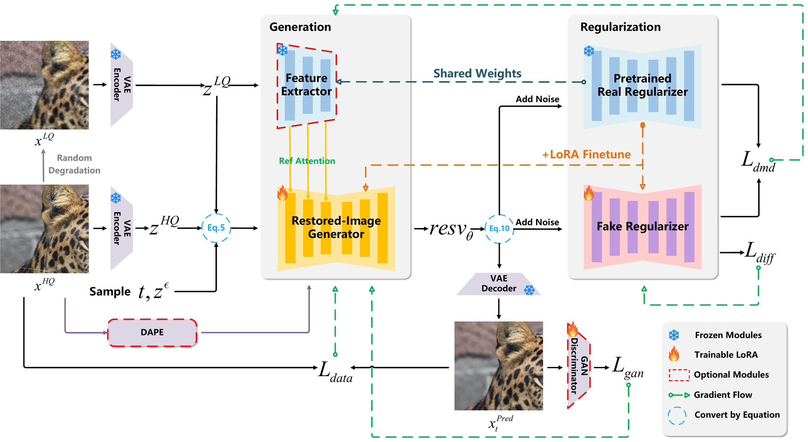
</p>

**Training pipeline.** The restored-image generator predicts the residual vector field under RRF. LQ features are injected as conditioning (for FLUX.2 they are concatenated with the input tokens), DAPE provides textual constraints, and DMD plus an optional GAN loss regularise the restored distribution. Both branches share the same frozen backbone; only LoRA adapters are trained.

## 🔧 Installation

```bash
git clone https://github.com/YukinoshitaLove/ScaleResfusion.git
cd ScaleResfusion

conda create -n scaleresfusion python=3.10 -y
conda activate scaleresfusion

# install a PyTorch build that matches your CUDA version, e.g.
pip install torch torchvision --index-url https://download.pytorch.org/whl/cu130
pip install -r requirements.txt
```

The FLUX.2-klein pipeline requires `diffusers==0.37.0` and `transformers==5.3.0` (pinned in `requirements.txt`). Tested on Ubuntu 24.04 with a single NVIDIA RTX 5090 (32 GB): Python 3.10, `torch 2.14.0+cu130`, `diffusers 0.37.0`, `transformers 5.3.0`, `peft 0.18.1`, `accelerate 1.15.0`, `pyiqa 0.1.16`; 4-step inference of the 4B model uses about 17.5 GB of GPU memory and takes well under one second per 512×512 image. If Hugging Face is slow to reach, set a mirror and a cache directory before running any script:

```bash
export HF_ENDPOINT=https://hf-mirror.com
export HF_HOME=/path/to/your/hf_cache
```

## 📦 Model Zoo

| Model | Description | Download |
|:---|:---|:---|
| FLUX.2-klein-base-4B | Frozen backbone (Apache-2.0), downloaded automatically from Hugging Face | [🤗 black-forest-labs/FLUX.2-klein-base-4B](https://huggingface.co/black-forest-labs/FLUX.2-klein-base-4B) |
| ScaleResfusion-FLUX2-4B (w/o GAN) | LoRA adapter, fidelity-oriented variant (`gen_hq_transformer_lora.safetensors`) | [huggingface](https://huggingface.co/flashszn/ScaleResfusion/tree/main/weights/4B) |
| ScaleResfusion-FLUX2-4B (w/ GAN) | LoRA adapter, perception-oriented variant (`gen_hq_transformer_lora.safetensors`) | [huggingface](https://huggingface.co/flashszn/ScaleResfusion/tree/main/weights/4B_gan) |
| RAM | Tagging model used by DAPE (`ram_swin_large_14m.pth`) | [🤗 recognize-anything](https://huggingface.co/spaces/xinyu1205/recognize-anything/blob/main/ram_swin_large_14m.pth) |
| DAPE | Degradation-aware prompt extractor from [SeeSR](https://github.com/cswry/SeeSR); checkpoint as redistributed by [OSEDiff](https://github.com/cswry/OSEDiff) (`DAPE.pth`) | [Google Drive](https://drive.google.com/file/d/1KIV6VewwO2eDC9g4Gcvgm-a0LDI7Lmwm/view?usp=drive_link) |

## ⚡ Quick Inference

### 1. Prepare inputs

Put the LQ images in a folder. Each image is paired with a caption file under `txt/` that holds the DAPE tags of that image:

```
test_LR/
├── 0001.png
├── 0002.png
├── ...
└── txt/
    ├── 0001.txt      # e.g. "building, sky, tree, window, ,"
    ├── 0002.txt
    └── ...
```

Generate the caption files with DAPE (RAM + LoRA) — this is the same prompt extractor used in the paper:

```bash
python generate_captions.py \
    --input_image test_LR \
    --ram_path    /path/to/ram_swin_large_14m.pth \
    --ram_ft_path /path/to/DAPE.pth
```

The benchmark captions used for our released results are produced by exactly this script (DAPE run on the ×4-upsampled LQ image), and they will be released together with the checkpoints. If you only want a quick try without RAM/DAPE, pass `--prompt ""` (or any fixed prompt) to the inference script and it will be used for images that have no caption file.

### 2. Run ScaleResfusion (FLUX.2-klein-4B, 4 steps)

```bash
python test_resfusion_flux2.py \
    --input_image    test_LR \
    --output_dir     results/test_LR_scaleresfusion \
    --resfusion_path /path/to/gen_hq_transformer_lora.safetensors \
    --pretrained_model_name_or_path black-forest-labs/FLUX.2-klein-base-4B
```

Restored images are written to `--output_dir` (the prompt of every image is also saved to `--output_dir/txt/`). Key options:

| Argument | Default | Meaning |
|:---|:---|:---|
| `--rsr` | `1.0` | Residual ratio $\gamma$. Sampling starts at $t^\star = 1/(1+\gamma)$; larger values start closer to the LQ image. |
| `--flowT` | `20` | Nominal number of rectified-flow steps before truncation at $t^\star$. `20` → **4** sampling steps (default), `10` → 2, `6` → 1, `42` → 10. |
| `--upscale` | `4` | Super-resolution factor. |
| `--process_size` | `512` | Inputs smaller than `process_size / upscale` are enlarged first and the output is resized back. |
| `--align_method` | `adain` | Colour correction w.r.t. the LQ input: `adain`, `wavelet` or `nofix`. |
| `--mixed_precision` | `fp16` | `fp16`, `bf16` or `fp32`. |
| `--prompt` | `None` | Fallback prompt for images without a caption file. |
| `--seed` | `42` | Random seed of the initial noise. |

### 3. Evaluate

We follow the [StableSR](https://github.com/IceClear/StableSR) protocol on DIV2K-Val, RealSR and DRealSR ([test sets](https://huggingface.co/datasets/Iceclear/StableSR-TestSets)), and additionally use a harder LSDIR-Val benchmark built by centre-cropping 512×512 patches from the LSDIR validation split. `test_metrics.py` reports PSNR, SSIM, LPIPS, DISTS, FID, NIQE, MUSIQ and MANIQA:

```bash
python test_metrics.py \
    --inp_imgs results/DrealSR_scaleresfusion \
    --gt_imgs  datasets/DrealSRVal_crop128/test_HR \
    --log      results/DrealSR_scaleresfusion
```

`scripts/inference_flux2_4b.sh` chains captioning, inference and evaluation for one benchmark split.

## 📏 Results
### Download link

```
hf download flashszn/ScaleResfusion --include "results/*" --local-dir ./download
```

All numbers below are from the paper. Unless stated otherwise, *Ours* uses the default **FLUX.2-klein-4B** backbone and **4 sampling steps**. **Bold** = best, *italic* = second best. ↑ higher is better, ↓ lower is better.

### Real-world benchmarks

<details open>
<summary><b>DRealSR</b></summary>

| Method | PSNR ↑ | SSIM ↑ | LPIPS ↓ | DISTS ↓ | FID ↓ | NIQE ↓ | MUSIQ ↑ | MANIQA ↑ |
|:---|:---|:---|:---|:---|:---|:---|:---|:---|
| BSRGAN | *28.70* | 0.80 | 0.29 | *0.21* | 155.61 | 6.54 | 57.15 | 0.48 |
| Real-ESRGAN | 28.61 | *0.81* | *0.28* | *0.21* | 147.66 | 6.70 | 54.27 | 0.49 |
| LDL | 28.20 | *0.81* | *0.28* | *0.21* | 155.51 | 7.14 | 53.94 | 0.49 |
| FeMaSR | 26.87 | 0.76 | 0.32 | 0.22 | 157.72 | **5.91** | 53.70 | 0.44 |
| StableSR | 28.04 | 0.75 | 0.33 | 0.23 | 144.15 | 6.60 | 58.53 | 0.56 |
| SUPIR | 25.09 | 0.65 | 0.42 | 0.28 | 169.48 | 7.39 | 58.79 | 0.55 |
| TSD-SR | 27.77 | 0.76 | 0.30 | *0.21* | 134.98 | **5.91** | **66.62** | 0.59 |
| AddSR | 26.68 | 0.74 | 0.37 | 0.26 | 164.82 | 7.80 | 65.36 | 0.60 |
| CCSR | 28.24 | 0.78 | 0.32 | 0.23 | 157.30 | 6.81 | 66.28 | 0.61 |
| DiffBIR | 25.90 | 0.62 | 0.47 | 0.29 | 180.33 | 6.33 | 66.13 | *0.62* |
| OSEDiff | 27.92 | 0.78 | 0.30 | 0.22 | 135.41 | 6.46 | 64.69 | 0.59 |
| PASD | 28.02 | 0.78 | 0.32 | 0.23 | 174.76 | 6.72 | 57.23 | 0.51 |
| ResShift | 27.05 | 0.74 | 0.39 | 0.26 | 159.90 | 8.65 | 51.24 | 0.47 |
| SeeSR | 28.07 | 0.77 | 0.32 | 0.23 | 147.37 | 6.41 | 65.09 | 0.61 |
| FluxSR | 20.88 | 0.61 | 0.39 | 0.25 | 144.66 | 7.11 | *66.38* | 0.57 |
| **Ours (w/o GAN)** | **29.77** | **0.82** | **0.25** | **0.20** | **118.18** | 6.95 | 62.42 | 0.61 |
| **Ours (w/ GAN)** | 28.26 | 0.78 | 0.29 | *0.21* | *124.03* | *6.21* | 65.16 | **0.64** |

</details>

<details>
<summary><b>RealSR</b></summary>

| Method | PSNR ↑ | SSIM ↑ | LPIPS ↓ | DISTS ↓ | FID ↓ | NIQE ↓ | MUSIQ ↑ | MANIQA ↑ |
|:---|:---|:---|:---|:---|:---|:---|:---|:---|
| BSRGAN | 26.38 | *0.77* | 0.27 | *0.21* | 141.24 | 5.64 | 63.28 | 0.54 |
| Real-ESRGAN | *26.65* | 0.76 | 0.27 | *0.21* | 136.29 | 5.85 | 60.45 | 0.55 |
| LDL | 25.28 | 0.76 | 0.28 | *0.21* | 142.74 | 5.99 | 60.92 | 0.55 |
| FeMaSR | 25.06 | 0.74 | 0.29 | 0.23 | 141.01 | 5.77 | 59.05 | 0.49 |
| StableSR | 24.62 | 0.70 | 0.31 | 0.22 | 128.54 | 5.78 | 65.48 | 0.62 |
| SUPIR | 23.65 | 0.66 | 0.35 | 0.25 | 130.38 | 6.11 | 62.09 | 0.58 |
| TSD-SR | 24.81 | 0.72 | 0.27 | *0.21* | 114.45 | **5.13** | *71.19* | 0.63 |
| AddSR | 22.65 | 0.65 | 0.38 | 0.27 | 154.18 | 6.62 | **71.41** | *0.67* |
| CCSR | 25.92 | 0.75 | 0.28 | *0.21* | 122.84 | 5.73 | 69.18 | 0.64 |
| DiffBIR | 24.83 | 0.65 | 0.36 | 0.24 | 130.75 | 5.84 | 69.28 | 0.65 |
| OSEDiff | 25.15 | 0.73 | 0.29 | *0.21* | 123.53 | 5.65 | 69.08 | 0.63 |
| PASD | 26.04 | 0.74 | 0.28 | *0.21* | 135.48 | 5.71 | 60.03 | 0.56 |
| ResShift | 25.66 | 0.74 | 0.33 | 0.25 | 128.03 | 8.07 | 56.89 | 0.51 |
| SeeSR | 25.15 | 0.72 | 0.30 | 0.22 | 125.30 | 5.40 | 69.81 | 0.65 |
| FluxSR | 23.83 | 0.69 | 0.32 | 0.23 | 120.63 | 6.57 | 70.07 | 0.61 |
| **Ours (w/o GAN)** | **27.05** | **0.78** | **0.24** | **0.20** | **104.74** | 6.21 | 67.25 | 0.64 |
| **Ours (w/ GAN)** | 25.78 | 0.75 | *0.26* | **0.20** | *106.22* | *5.29* | 69.86 | **0.68** |

</details>

### Synthetic benchmarks

<details>
<summary><b>DIV2K-Val</b></summary>

| Method | PSNR ↑ | SSIM ↑ | LPIPS ↓ | DISTS ↓ | FID ↓ | NIQE ↓ | MUSIQ ↑ | MANIQA ↑ |
|:---|:---|:---|:---|:---|:---|:---|:---|:---|
| BSRGAN | 24.58 | *0.63* | 0.35 | 0.23 | 49.55 | 4.75 | 61.68 | 0.50 |
| Real-ESRGAN | 24.02 | **0.64** | 0.32 | 0.21 | 38.87 | 4.83 | 60.38 | 0.54 |
| LDL | 23.83 | *0.63* | 0.33 | 0.22 | 42.28 | 4.86 | 60.04 | 0.53 |
| FeMaSR | 22.45 | 0.59 | 0.34 | 0.22 | 41.97 | 4.87 | 57.94 | 0.48 |
| StableSR | 23.27 | 0.57 | 0.31 | 0.20 | 24.95 | 4.77 | 65.78 | 0.62 |
| SUPIR | 22.13 | 0.53 | 0.39 | 0.23 | 31.40 | 5.68 | 63.86 | 0.59 |
| TSD-SR | 23.02 | 0.58 | *0.27* | *0.18* | 29.16 | **4.32** | **71.69** | 0.62 |
| AddSR | 22.37 | 0.56 | 0.38 | 0.23 | 34.91 | 5.84 | 69.15 | 0.63 |
| CCSR | 24.30 | *0.63* | 0.30 | 0.20 | 30.84 | 5.34 | 69.53 | 0.61 |
| DiffBIR | 23.14 | 0.54 | 0.37 | 0.22 | 32.71 | 4.99 | *69.87* | *0.64* |
| OSEDiff | 23.72 | 0.61 | 0.29 | 0.20 | 26.34 | 4.71 | 67.96 | 0.61 |
| PASD | 24.01 | 0.61 | 0.38 | 0.22 | 37.06 | 4.98 | 63.75 | 0.55 |
| ResShift | *24.59* | 0.62 | 0.31 | 0.21 | 30.81 | 6.92 | 58.90 | 0.53 |
| SeeSR | 23.68 | 0.60 | 0.32 | 0.20 | 25.89 | 4.81 | 68.66 | 0.62 |
| **Ours (w/o GAN)** | **24.90** | **0.64** | *0.27* | *0.18* | *22.90* | 5.09 | 66.10 | 0.63 |
| **Ours (w/ GAN)** | 23.63 | 0.60 | **0.26** | **0.17** | **19.47** | *4.44* | 69.30 | **0.68** |

</details>

<details>
<summary><b>LSDIR-Val</b></summary>

| Method | PSNR ↑ | SSIM ↑ | LPIPS ↓ | DISTS ↓ | FID ↓ | NIQE ↓ | MUSIQ ↑ | MANIQA ↑ |
|:---|:---|:---|:---|:---|:---|:---|:---|:---|
| BSRGAN | 20.82 | 0.54 | 0.25 | 0.16 | 46.37 | 4.21 | 68.94 | 0.63 |
| Real-ESRGAN | 20.58 | *0.55* | 0.24 | *0.15* | *41.28* | 4.18 | 69.52 | 0.64 |
| LDL | 20.31 | 0.53 | 0.25 | 0.16 | 44.75 | 4.36 | 68.61 | 0.64 |
| FeMaSR | 19.87 | 0.51 | 0.27 | 0.17 | 48.63 | 4.09 | 67.85 | 0.61 |
| StableSR | 20.31 | *0.55* | 0.31 | 0.18 | 54.76 | 5.07 | 62.96 | 0.61 |
| SUPIR | 20.35 | 0.50 | 0.24 | *0.15* | 43.81 | 4.81 | 71.47 | 0.67 |
| TSD-SR | 19.05 | 0.49 | **0.21** | **0.14** | 45.66 | 3.86 | **74.45** | 0.68 |
| AddSR | 19.20 | 0.45 | 0.34 | 0.20 | 79.80 | 4.99 | *74.20* | **0.70** |
| CCSR | 20.76 | 0.53 | 0.26 | 0.16 | 56.28 | 4.25 | 72.57 | 0.66 |
| DiffBIR | 20.51 | 0.49 | 0.27 | 0.16 | 58.45 | 4.44 | 73.26 | 0.68 |
| OSEDiff | 20.39 | 0.52 | 0.27 | 0.16 | 59.57 | 4.03 | 72.34 | 0.66 |
| PASD | 20.93 | 0.52 | 0.31 | 0.17 | 59.11 | **3.80** | 69.29 | 0.62 |
| ResShift | *21.23* | *0.55* | *0.23* | **0.14** | **38.98** | 5.32 | 68.56 | 0.61 |
| SeeSR | 20.69 | 0.52 | 0.25 | *0.15* | 52.06 | 4.10 | 73.27 | 0.68 |
| **Ours (w/o GAN)** | **21.35** | **0.57** | *0.23* | **0.14** | 41.69 | 4.21 | 70.61 | 0.67 |
| **Ours (w/ GAN)** | 20.64 | *0.55* | **0.21** | **0.14** | 43.56 | *3.82* | 72.59 | *0.69* |

</details>

### Efficiency

Number of function evaluations (NFE) and average inference time per 512×512 image on a single NVIDIA RTX A6000:

| Method | StableSR | SUPIR | SeeSR | ResShift | CCSR | OSEDiff | **Ours** |
|:---|:---:|:---:|:---:|:---:|:---:|:---:|:---:|
| NFE | 200 | 50 | 50 | 15 | 6 | 1 | **4** |
| Inference time (ms) | 12,036 | 25,252 | 4,445 | 848 | 516 | 266 | **646** |

### Backbone generality

RRF transfers consistently across pre-trained rectified-flow backbones from 2B to 9B parameters (DRealSR). The upper block is *w/o GAN*, the lower block *w/ GAN*:

| Backbone | PSNR ↑ | SSIM ↑ | LPIPS ↓ | DISTS ↓ | FID ↓ |
|:---|:---|:---|:---|:---|:---|
| SD3 (2B) | 28.77 | 0.79 | 0.30 | 0.23 | 149.67 |
| FLUX2-Klein (4B) | *29.77* | **0.82** | **0.25** | *0.20* | *118.18* |
| Z-Image (6B) | 29.35 | *0.80* | *0.28* | 0.22 | 132.31 |
| FLUX2-Klein (9B) | **30.17** | **0.82** | **0.25** | **0.19** | **109.28** |
| SD3 (2B), w/ GAN | 27.86 | 0.76 | 0.32 | 0.22 | 146.93 |
| FLUX2-Klein (4B), w/ GAN | 28.26 | *0.78* | *0.29* | *0.21* | *124.03* |
| Z-Image (6B), w/ GAN | *28.34* | *0.78* | **0.28** | *0.21* | 127.40 |
| FLUX2-Klein (9B), w/ GAN | **28.77** | **0.79** | **0.28** | **0.19** | **116.69** |

<p align="center">
  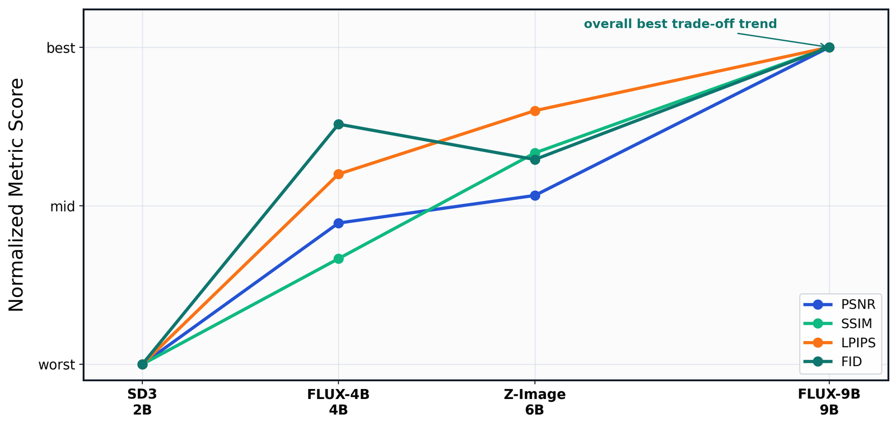
</p>

### Sampling steps

Separately trained 4-, 2- and 1-step FLUX.2-4B models on DRealSR. Even the 1-step model stays competitive thanks to the RRF acceleration point:

| NFE | PSNR ↑ | SSIM ↑ | LPIPS ↓ | FID ↓ |
|:---|:---|:---|:---|:---|
| 4-step | **29.77** | **0.82** | **0.25** | 118.18 |
| 2-step | *29.03* | *0.79* | *0.27* | **115.43** |
| 1-step | 28.93 | 0.78 | 0.28 | *117.56* |

<p align="center">
  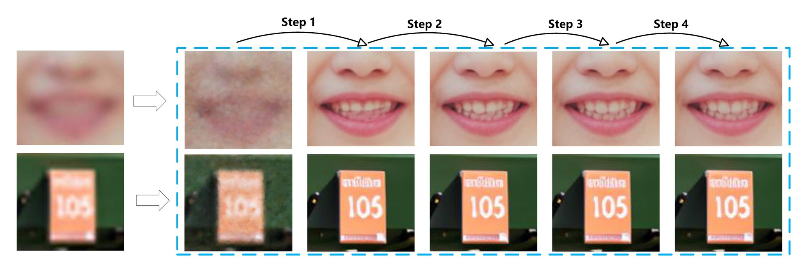
</p>
<p align="center"><i>Intermediate predictions of a single 4-step model: early steps recover the global structure, later steps refine details.</i></p>

### Visual comparison

<p align="center">
  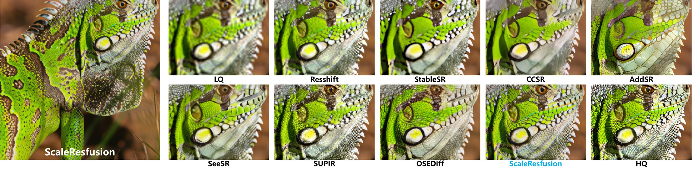
</p>

<details>
<summary>More visual comparisons (click to expand)</summary>

<p align="center"><b>DRealSR</b></p>
<p align="center">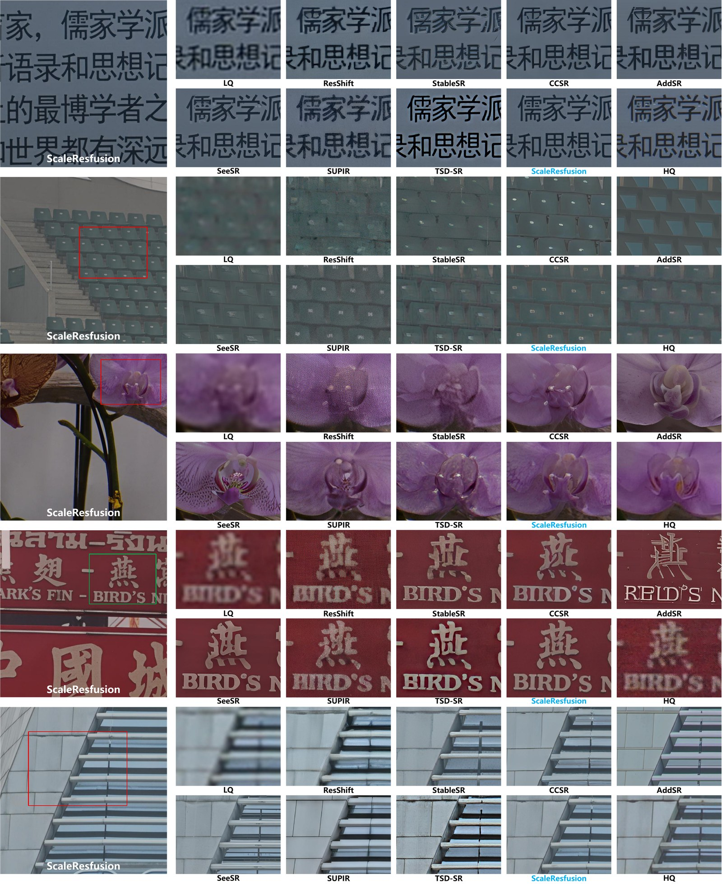</p>
<p align="center"><b>RealSR</b></p>
<p align="center">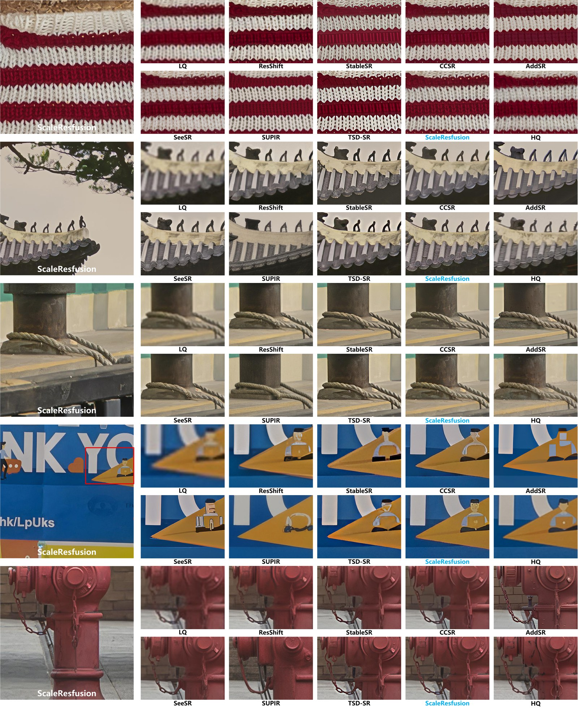</p>
<p align="center"><b>DIV2K-Val</b></p>
<p align="center">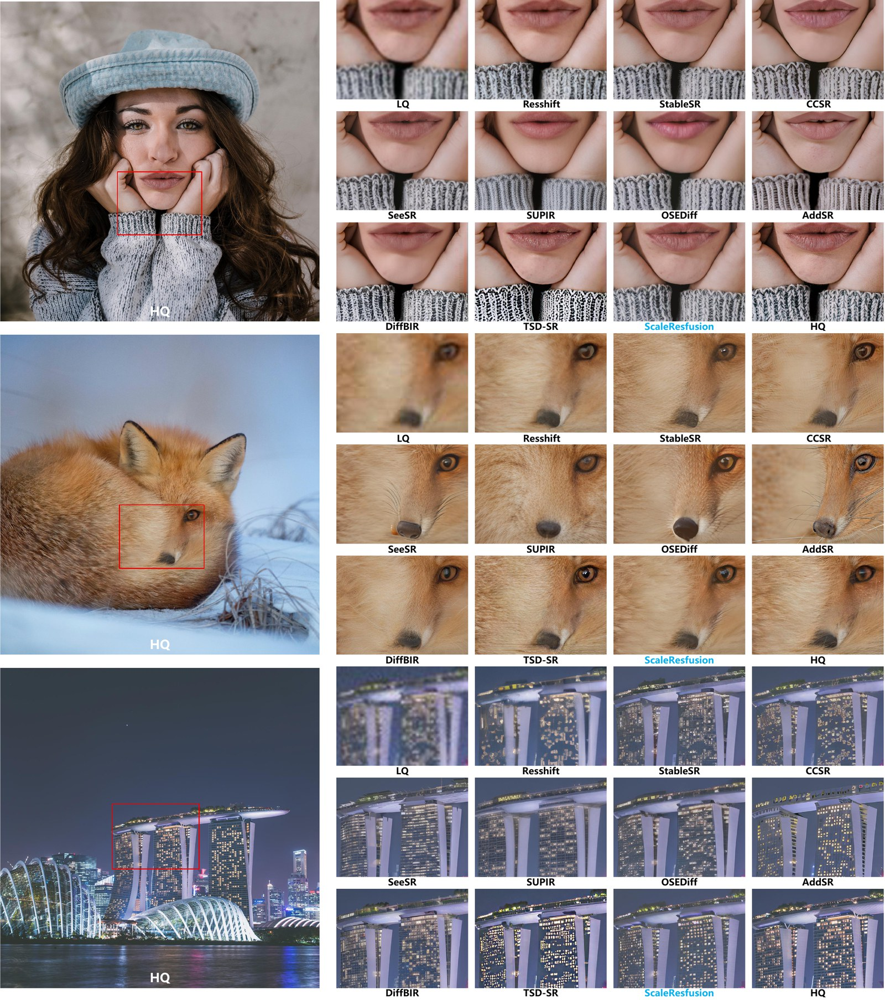</p>
<p align="center"><b>LSDIR-Val</b></p>
<p align="center">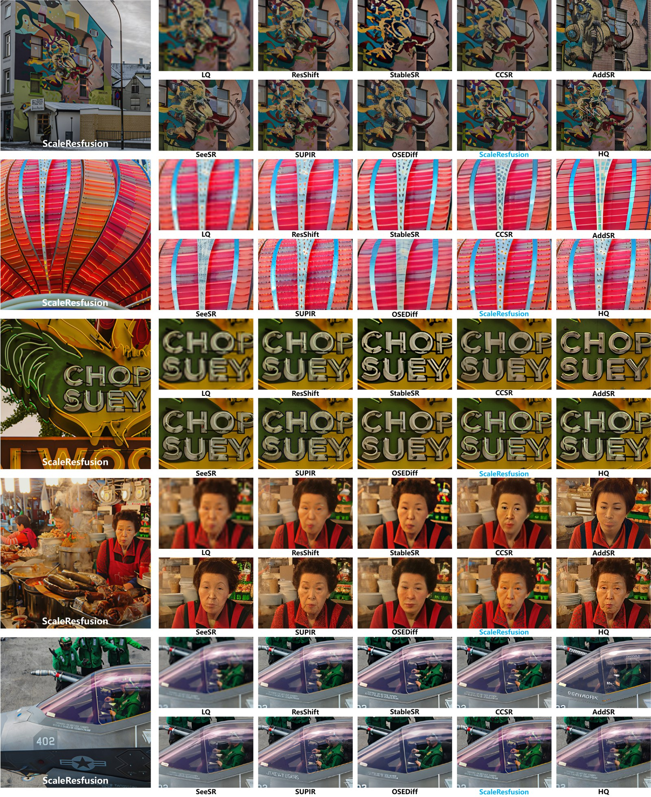</p>
<p align="center"><b>WebPhoto-Test (in-the-wild face restoration, zero-shot)</b></p>
<p align="center">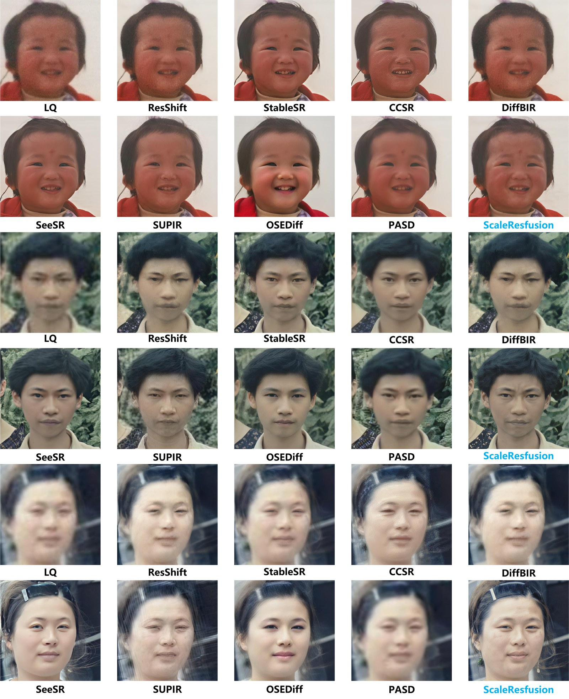</p>

</details>

### User study

<p align="center">
  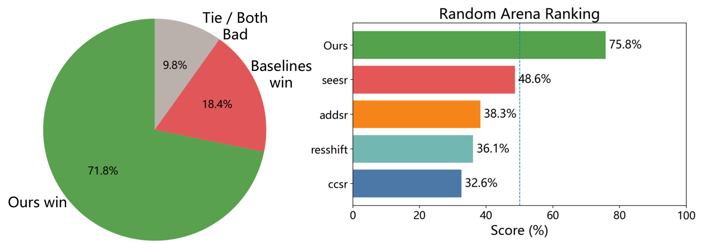
</p>
<p align="center"><i>Pairwise arena with 48 evaluators and 1,756 comparisons: ScaleResfusion is preferred in 71.8% of cross-model comparisons and tops the Random Arena ranking with a 75.8% overall score.</i></p>

## 🎓 Citation

If ScaleResfusion helps your research or work, please consider citing:

```bibtex
@article{shi2026scaleresfusion,
  title   = {ScaleResfusion: Residual Rectified Flow based on Residual Vector Field},
  author  = {Shi, Zhenning and Xu, Chen and Zhang, Junhao and Zhang, Kefei and Liu, Linjie and Zheng, Zhedong and Li, Tao},
  journal = {arXiv preprint arXiv:2607.25275},
  year    = {2026}
}
```

You may also be interested in our earlier residual diffusion work, [Resfusion](https://github.com/nkicsl/Resfusion) (NeurIPS 2024):

```bibtex
@article{shi2024resfusion,
  title   = {Resfusion: Denoising diffusion probabilistic models for image restoration based on prior residual noise},
  author  = {Shi, Zhenning and Zheng, Haoshuai and Xu, Chen and Dong, Changsheng and Pan, Bin and Xie, Xueshuo and He, Along and Li, Tao and Fu, Huazhu},
  journal = {Advances in Neural Information Processing Systems},
  volume  = {37},
  pages   = {130664--130693},
  year    = {2024}
}
```

## 🎫 License

This project is released under the [Apache 2.0 license](LICENSE). The FLUX.2-klein-base-4B backbone is distributed by Black Forest Labs under Apache 2.0; RAM and DAPE follow the licenses of their original repositories.

## 🙏 Acknowledgements

This code is built on [OSEDiff](https://github.com/cswry/OSEDiff) and [🤗 diffusers](https://github.com/huggingface/diffusers). We thank the authors of [Resfusion](https://github.com/nkicsl/Resfusion), [SeeSR](https://github.com/cswry/SeeSR) (DAPE), [Recognize Anything](https://github.com/xinyu1205/recognize-anything) (RAM), [StableSR](https://github.com/IceClear/StableSR) (test sets and colour correction), [FLUX.2](https://bfl.ai/blog/flux-2) and [pyiqa](https://github.com/chaofengc/IQA-PyTorch) for their excellent work.

## 📧 Contact

If you have any questions, please feel free to contact `shizhenning@mail.nankai.edu.cn` or open an issue.
